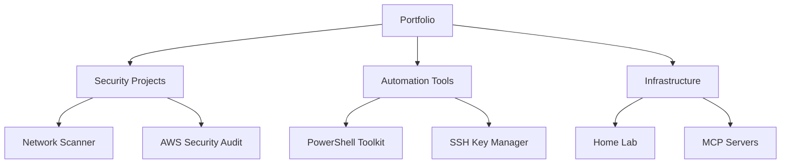
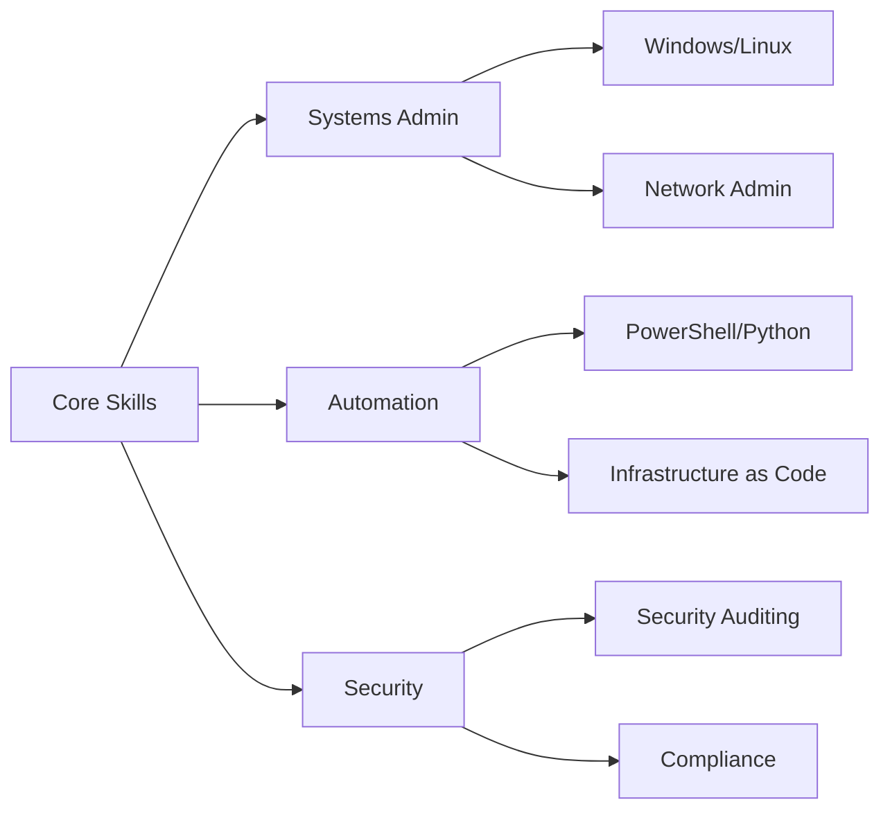

# Enzo Lucchesi - IT Professional

## About Me

IT professional with 5+ years of hands-on experience in systems administration, network infrastructure, and automation. Currently serving as IT Systems & Procurement Manager at Mazza Iron & Steel, where I've reduced operational costs by 75% through strategic technology implementation.

My background combines practical enterprise IT management with emerging technology exploration, including LLM workflows and automation development. I'm actively pursuing industry certifications (CCNA scheduled July 2025) while completing my B.S. in Information Technology.

## Portfolio Overview

## Featured Projects

### 🔒 Security & Compliance

#### [AWS Security Audit Suite](https://github.com/lucchesi-sec/aws-security-audit-suite)
AWS security scanning tool with async architecture and multi-framework compliance mapping. Identifies misconfigurations, exposed resources, and compliance gaps.

#### [Network Vulnerability Scanner](https://github.com/lucchesi-sec/network-vulnerability-scanner)
Comprehensive network assessment tool with SSL/TLS analysis, service detection, and extensible plugin architecture. Built with ethical guidelines and responsible disclosure practices.

### 🤖 Automation & Efficiency

#### [PowerShell Automation Toolkit](https://github.com/lucchesi-sec/powershell-automation)
Modular PowerShell platform for enterprise automation including Active Directory lifecycle management, automated backup/recovery, and security auditing. Developed for use at Mazza Iron & Steel.

#### [SSH Key Lifecycle Manager](https://github.com/lucchesi-sec/ssh-key-lifecycle-manager)
Automated SSH key management tool with safety features, comprehensive backup mechanisms, and audit logging. Designed to significantly reduce manual key rotation overhead.

### 🛠️ Infrastructure & Development

#### [AWS Infrastructure Security MCP Server](https://github.com/lucchesi-sec/aws-infrasec-mcp-server)
TypeScript-based Model Context Protocol server for AWS security analysis. Demonstrates modern API development and AI workflow integration capabilities.

#### [Ansible Network Automation Platform](https://github.com/lucchesi-sec/ansible-network-automation-platform)
Network automation framework with 23+ infrastructure roles, zero-trust security implementation, and comprehensive deployment automation.

## Technical Skills

### Operating Systems & Infrastructure
- **Windows**: Server 2016-2022, Active Directory, Group Policy, Microsoft 365
- **Linux**: Ubuntu/CentOS administration, shell scripting, system hardening
- **Virtualization**: Proxmox VE, VMware, LXC containers
- **Networking**: VLANs, pfSense, Nginx, TCP/IP troubleshooting

### Development & Automation
- **Languages**: PowerShell, Python, Bash, TypeScript
- **Automation**: Zapier integrations, OCR workflows, API development
- **AI/ML**: LLM implementation, Ollama, RAG pipelines, MCP server development
- **IaC**: Learning Infrastructure as Code (Ansible, basic Terraform), configuration management

### Security & Compliance
- **Tools**: Wireshark, security scanning, firewall configuration
- **Practices**: Network segmentation, access control, backup strategies
- **Standards**: Following NIST guidelines, security auditing, incident response

## Professional Experience

**IT Systems & Procurement Manager** - Mazza Iron & Steel, LLC (Oct 2023 - Present)
- Eliminated MSP reliance for 20+ users, reducing costs by 75%
- Deployed fiber-optic infrastructure to remote office
- Built comprehensive IT documentation system in Notion

**Systems Administrator** - Cox Automotive (Jan 2016 - Oct 2023)
- Sole administrator for high-volume vehicle diagnostics operation (1000+ units/week)
- Migrated legacy SQL systems to modern shop management platform
- Implemented Veeam backup strategy with zero data loss over 5 years

## Education & Certifications

- **B.S. Information Technology** - Western Governors University (Expected May 2027)
- **CompTIA A+** - Certified
- **CCNA** - Scheduled July 2025

## Current Focus

- Building practical security experience through hands-on projects
- Developing automation solutions for enterprise environments
- Exploring AI/LLM integration in IT operations
- Pursuing industry certifications to formalize expertise

## Contact

- **Email**: enzo@droxa.net
- **GitHub**: [github.com/lucchesi-sec](https://github.com/lucchesi-sec)
- **Location**: Bordentown, NJ

---

*Interested in discussing IT infrastructure, automation, or security projects? Feel free to reach out!*