# ML/AI DevSecOps Pipeline Architecture

```mermaid
graph TD
    A["🔄 DevSecOps ML Pipeline"] --> B["Code Analysis"]
    A --> C["Security Testing"]
    A --> D["Model Training"]
    
    B --> E["AI Code Review"]
    C --> F["ML Threat Detection"]
    D --> G["Security Model Ops"]
    
    classDef pipeline fill:#2563eb,stroke:#1e40af,stroke-width:3px,color:#ffffff
    classDef stage fill:#64748b,stroke:#475569,stroke-width:2px,color:#ffffff
    classDef output fill:#059669,stroke:#047857,stroke-width:2px,color:#ffffff
    
    class A pipeline
    class B,C,D stage
    class E,F,G output
```

## Pipeline Components

### Code Analysis
- AI-powered vulnerability detection
- Automated security code review
- Intelligent dependency scanning

### Security Testing
- ML-enhanced penetration testing
- Behavioral anomaly detection
- Automated threat modeling

### Model Training
- Security ML model deployment
- Continuous model monitoring
- Automated retraining workflows