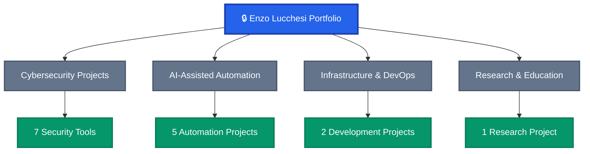

# Portfolio Architecture Overview

```mermaid
graph TD
    A["🔒 Enzo Lucchesi Portfolio"] --> B["Cybersecurity Projects"]
    A --> C["AI-Assisted Automation"] 
    A --> D["Infrastructure & DevOps"]
    A --> E["Research & Education"]

    B --> F["7 Security Tools"]
    C --> G["5 Automation Projects"]
    D --> H["2 Development Projects"]
    E --> I["1 Research Project"]

    classDef portfolio fill:#2563eb,stroke:#1e40af,stroke-width:3px,color:#ffffff
    classDef category fill:#64748b,stroke:#475569,stroke-width:2px,color:#ffffff
    classDef projects fill:#059669,stroke:#047857,stroke-width:2px,color:#ffffff

    class A portfolio
    class B,C,D,E category
    class F,G,H,I projects
```