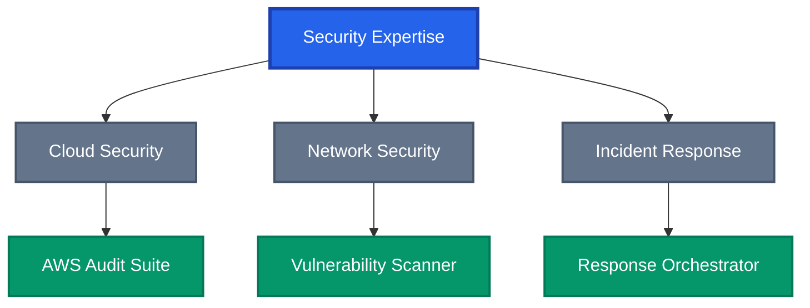

# Security Expertise Flow

```mermaid
graph TD
    A["Security Expertise"] --> B["Cloud Security"]
    A --> C["Network Security"]
    A --> D["Incident Response"]

    B --> E["AWS Audit Suite"]
    C --> F["Vulnerability Scanner"]
    D --> G["Response Orchestrator"]

    classDef expertise fill:#2563eb,stroke:#1e40af,stroke-width:3px,color:#ffffff
    classDef domain fill:#64748b,stroke:#475569,stroke-width:2px,color:#ffffff
    classDef tools fill:#059669,stroke:#047857,stroke-width:2px,color:#ffffff

    class A expertise
    class B,C,D domain
    class E,F,G tools
```