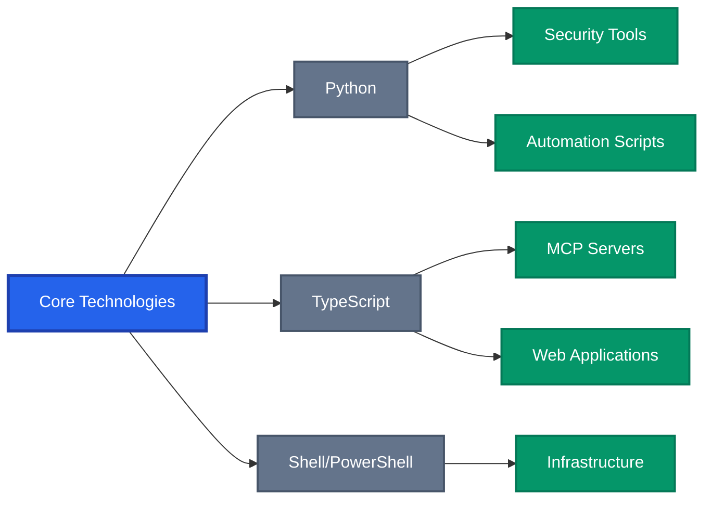

# Technology Stack Matrix

```mermaid
graph LR
    A["Core Technologies"] --> B["Python"]
    A --> C["TypeScript"]
    A --> D["Shell/PowerShell"]

    B --> E["Security Tools"]
    B --> F["Automation Scripts"]
    C --> G["MCP Servers"]
    C --> H["Web Applications"]
    D --> I["Infrastructure"]

    classDef core fill:#2563eb,stroke:#1e40af,stroke-width:3px,color:#ffffff
    classDef lang fill:#64748b,stroke:#475569,stroke-width:2px,color:#ffffff
    classDef apps fill:#059669,stroke:#047857,stroke-width:2px,color:#ffffff

    class A core
    class B,C,D lang
    class E,F,G,H,I apps
```