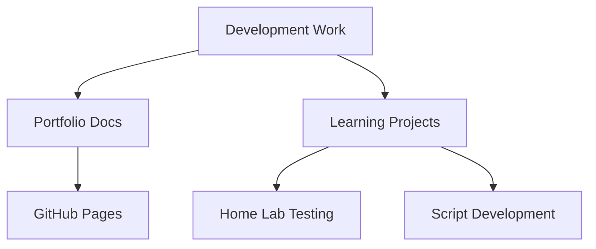

# Development & Learning Projects

## Overview

This section showcases my development work and learning projects, demonstrating practical application of programming concepts and documentation skills. These projects reflect my hands-on approach to solving problems and continuous learning in software development.

## Featured Projects

### [Portfolio Repository](https://github.com/lucchesi-sec/portfolio)

Professional portfolio documentation showcasing my technical projects and experience.

**Key Features:**
- Comprehensive project documentation
- Clean Mermaid diagrams (simple, professional design)
- Mobile-responsive GitHub Pages deployment
- Professional presentation suitable for technical review

**Technical Implementation:**
- Markdown documentation with consistent formatting
- Mermaid.js for architecture diagrams
- GitHub Pages for static site hosting
- Responsive design principles

### [Cybersecurity Learning Projects](https://github.com/lucchesi-sec/cybersec-projects)

Collection of hands-on security projects designed to build practical experience in cybersecurity.

**Purpose:**
- Educational projects demonstrating security concepts
- Practical implementation of security tools
- Learning through hands-on exercises
- Documentation of security learning journey

## Development Architecture

## Technical Skills

### Programming & Scripting
- **PowerShell**: Enterprise automation and system administration
- **Python**: Security tools and automation scripts
- **Bash**: Linux automation and system maintenance
- **TypeScript**: MCP server development and API work

### Development Tools
- **Version Control**: Git, GitHub
- **Documentation**: Markdown, Mermaid diagrams
- **Testing**: Home lab environment for validation
- **Deployment**: GitHub Pages, local testing

### Learning Areas
- **Infrastructure as Code**: Learning Ansible, basic Terraform
- **API Development**: MCP protocol implementation
- **Security Programming**: Vulnerability scanning tools
- **Automation**: CI/CD concepts and workflow automation

## Documentation Philosophy

My approach to development documentation emphasizes:

1. **Clarity First**: Clear, concise explanations over complex technical jargon
2. **Visual Communication**: Simple diagrams to illustrate concepts
3. **Practical Examples**: Real-world use cases and implementations
4. **Continuous Improvement**: Regular updates and refinements
5. **Professional Presentation**: Executive-level quality suitable for technical review

## Current Focus

- **Documentation Excellence**: Creating professional technical documentation
- **Learning Modern Practices**: Exploring DevOps and automation concepts
- **Security Integration**: Combining security practices with development
- **Practical Application**: Building tools that solve real problems

---

*Building practical solutions through code and comprehensive documentation*