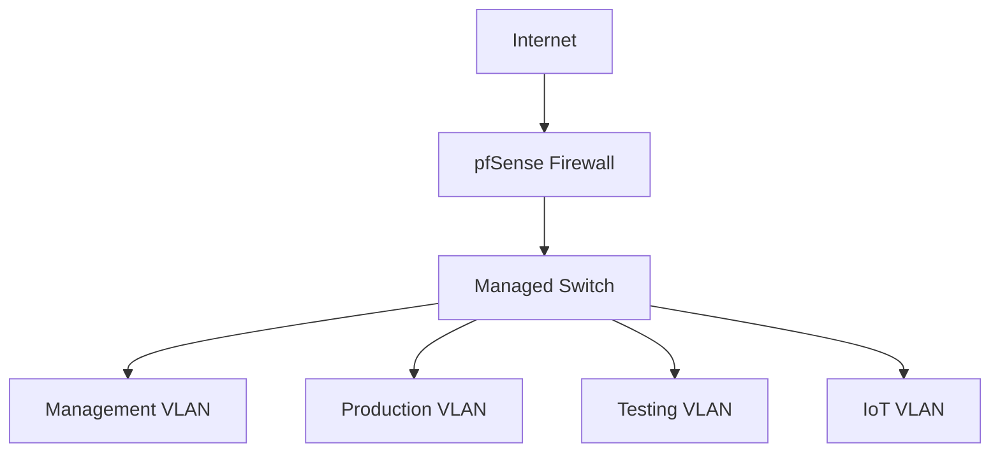

# Infrastructure & IT Administration

## Overview

With over 5 years of hands-on experience in systems administration, I've built and managed infrastructure ranging from small business environments to high-volume operations. This section showcases my practical infrastructure projects and IT administration expertise.

## Production Infrastructure Experience

### Mazza Iron & Steel IT Infrastructure

As IT Systems & Procurement Manager, I architected and maintain:

**Network Infrastructure:**
- Deployed fiber-optic link to connect remote office
- Configured VLANs for network segmentation
- Implemented pfSense firewall with security policies
- Managed Microsoft 365 environment for 20+ users

**Cost Optimization:**
- Eliminated MSP dependency, reducing costs by 75%
- Negotiated vendor contracts and procurement
- Implemented in-house support strategy
- Built comprehensive documentation in Notion

### Cox Automotive High-Volume Operation

Sole Systems Administrator for a vehicle diagnostics operation processing 1,000+ units weekly:

**Windows Environment Management:**
- Administered 12+ workstations with Group Policy
- Managed Active Directory users and permissions
- Implemented automated patching strategies
- Maintained Microsoft 365 user accounts

**Critical Migrations:**
- Led migration from legacy SQL application to modern SaaS platform
- Zero downtime during transition
- Complete data migration and validation
- User training and documentation

**Backup & Disaster Recovery:**
- Configured Veeam Backup & Replication
- Implemented 3-2-1 backup strategy
- Maintained zero data loss over 5-year period
- Regular restore testing and validation

## Home Lab Environment

### Infrastructure Overview

My home lab serves as a testing ground for new technologies and continuous learning:

**Virtualization Platform:**
- **Proxmox VE** cluster for high availability
- Mix of VMs and LXC containers
- Resource optimization and monitoring
- Automated backups and snapshots

**Network Architecture:**

**Security Implementation:**
- pfSense firewall with IDS/IPS
- VLAN segmentation for security
- WireGuard VPN for remote access
- Nginx reverse proxy with SSL termination

**Services Deployed:**
- Nextcloud for file synchronization
- Local LLM infrastructure (Ollama)
- Development environments
- Monitoring stack (Prometheus/Grafana)

### Learning & Experimentation

The home lab enables hands-on experience with:
- Kubernetes orchestration (learning)
- Learning Infrastructure as Code (Terraform/Ansible)
- CI/CD pipeline implementation
- Security tool development and testing

## Enterprise Projects

### [Google Cybersecurity Certificate Portfolio](https://github.com/lucchesi-sec/Google-Cybersec)

Coursera Google Cybersecurity Certificate completion with practical labs and projects demonstrating:
- Network security fundamentals
- Security operations center (SOC) concepts
- Incident response procedures
- Risk assessment methodologies

### Infrastructure Automation

Building on my systems administration experience, I've developed several infrastructure automation tools as personal learning projects:

**Automated Deployment Scripts:**
- Windows Server deployment automation
- Linux server provisioning
- Application stack deployment
- Configuration management

**Monitoring & Alerting:**
- Custom PowerShell monitoring scripts
- Automated health checks
- Performance baseline tracking
- Proactive alert systems

## Technical Expertise

### Operating Systems
- **Windows Server**: 2016-2022, Core and Desktop Experience
- **Active Directory**: Design, implementation, and management
- **Linux**: Ubuntu Server, CentOS, system hardening
- **Virtualization**: Proxmox VE, VMware vSphere basics

### Networking
- **Routing & Switching**: VLANs, inter-VLAN routing
- **Firewalls**: pfSense configuration and management
- **Protocols**: TCP/IP, DNS, DHCP troubleshooting
- **VPN**: WireGuard, OpenVPN implementation

### Cloud & Hybrid
- **Microsoft 365**: Administration and security
- **AWS/Azure**: Basic infrastructure deployment
- **Hybrid Integration**: On-premises to cloud connectivity
- **Backup Solutions**: Veeam, cloud backup strategies

## Infrastructure Philosophy

My approach to infrastructure management emphasizes:

1. **Reliability First**: Build redundant, resilient systems
2. **Security by Design**: Implement defense in depth
3. **Automation**: Eliminate manual tasks where possible
4. **Documentation**: Maintain comprehensive runbooks
5. **Continuous Improvement**: Regular reviews and updates

## Key Achievements

- **High Availability**: Focus on maintaining critical systems reliability
- **75% Cost Reduction**: Through strategic infrastructure decisions at Mazza Iron & Steel
- **Proactive Security**: Emphasis on preventive security measures
- **Successful Migrations**: Multiple zero-downtime migrations completed

## Current Focus Areas

- **Container Orchestration**: Learning Kubernetes through hands-on labs
- **Infrastructure as Code**: Developing Terraform/Ansible skills
- **Cloud Architecture**: Pursuing cloud certifications
- **Security Automation**: Integrating security into infrastructure

---

*Building reliable, secure, and efficient infrastructure that enables business success*